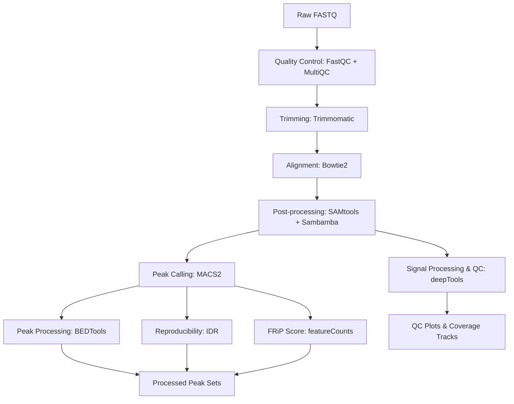

# ChIP-seq Paired-End Analysis (Modular Bash Workflow)

This repository contains a step-wise, modular ChIP-seq/DAP-seq analysis workflow implemented using individual Bash scripts.  
The pipeline was developed for *Arabidopsis thaliana* datasets and is designed to provide learning, transparency, and flexibility in processing.

---

## 🧠 Design Philosophy

This workflow is intentionally implemented as separate scripts without automation or looping.

The goals are to:
- Provide full transparency into each analysis step  
- Allow step-by-step execution and debugging  
- Enable easy modification or replacement of individual components  

This approach is particularly useful for learning, teaching, and exploratory analysis.

---

## 📂 Pipeline Steps

Each step of the pipeline is executed independently:

1. Quality Control (FastQC + MultiQC)  
2. Trimming  
3. Alignment  
4. Post-processing (SAM/BAM processing, filtering)  
5. Signal processing and visualization (deepTools)  
6. Peak calling (MACS2)  
7. Peak processing and comparison (bedtools)  
8. Reproducibility analysis (IDR)  
9. FRiP score calculation  

---

## 🔄 Pipeline Overview



---

## 🚀 Example Execution

```bash
# Step 1: Quality control
bash scripts/01_fastqc.sh

# Step 2: Trimming
bash scripts/02_trimming.sh sample_R1.fastq.gz sample_R2.fastq.gz output/

# Step 3: Alignment
bash scripts/03_alignment.sh

# Step 4: Post-processing
bash scripts/04_postprocessing.sh
```

## ✂️ Trimming (Example Step)

Adapter removal and quality trimming is performed using Trimmomatic.

Parameters used:
ILLUMINACLIP:TruSeq3-PE.fa:2:30:10:2 → Adapter removal
LEADING:3 → Remove low-quality bases from start
TRAILING:3 → Remove low-quality bases from end
SLIDINGWINDOW:4:15 → Trim when average quality drops below 15
MINLEN:35 → Discard reads shorter than 35 bp

Reads shorter than 35 bp are removed to improve alignment quality and reduce ambiguous mapping.

---

## 🛠 Tools Used
FastQC
MultiQC
Trimmomatic
Bowtie2
SAMtools
Sambamba
deepTools
MACS2
BEDTools
IDR
featureCounts (Subread package)

---

## 📁 Directory Structure
scripts/        # Individual scripts for each step
input/          # Input FASTQ files
output/         # Output files
🚀 How to Use

Clone the repository:

```bash
git clone https://github.com/Aakankshas90/ChIP-seq_pairedend.git
cd ChIP-seq_pairedend
```

Run each step manually using the provided scripts (see example above).
Modify paths, file names, and parameters in scripts as needed.

Note: Thread numbers (e.g., -@ 16, -p 20) should be adjusted based on available CPU resources.

---

## ⚠️ Limitations
- Processes one dataset at a time
- Requires manual execution of each step
- No built-in parallelization or workflow management
- Paths and tool locations may need to be adjusted by the user

---

## 🚀 Future Improvements
- Add batch processing (looping over multiple samples)
- Convert to a Nextflow-based workflow
- Add containerization (Docker/Singularity)
- Integrate automated QC reporting
- Improve parameterization and configuration handling

---

## 📌 Notes
- Optimized for *Arabidopsis thaliana* datasets
- Can be adapted for other organisms with appropriate reference genome and annotation files
